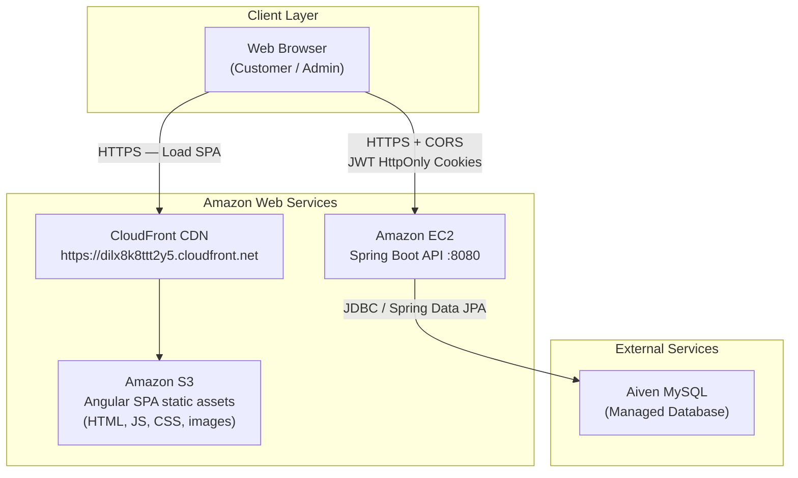
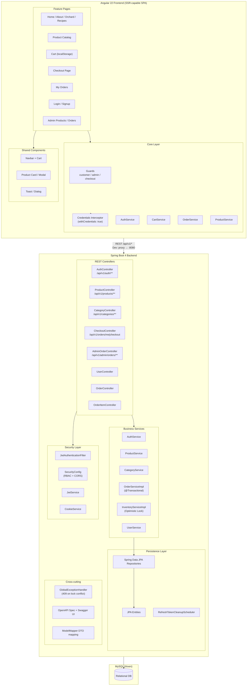
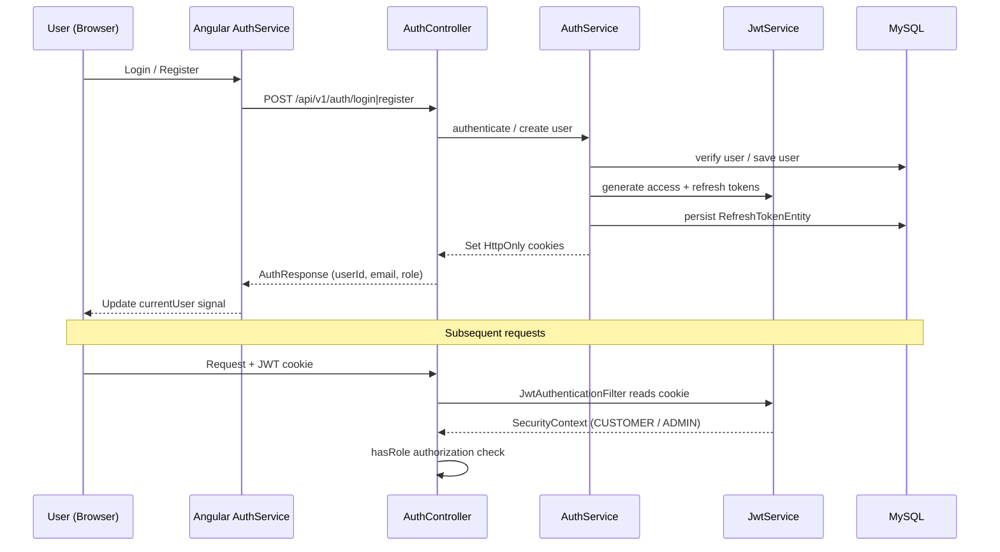
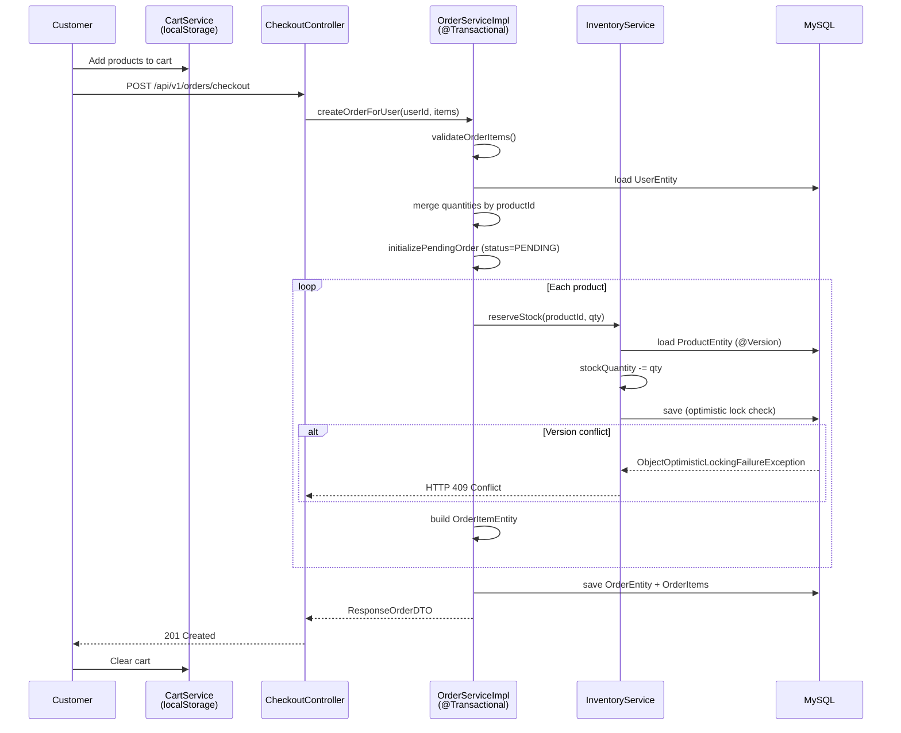
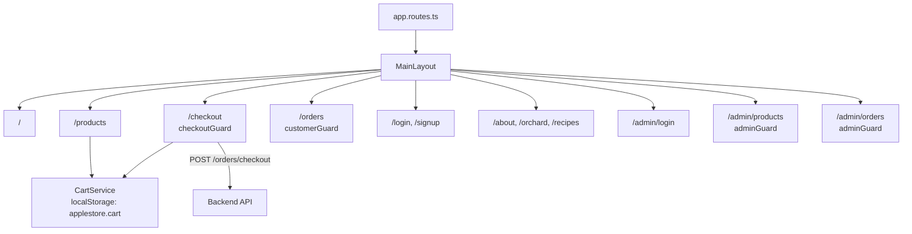

# Grove & Root — System Architecture

> Render on GitHub, VS Code (Mermaid extension), or [mermaid.live](https://mermaid.live).

## 1. Deployment Architecture (AWS)

## 2. Application Architecture

## 3. Authentication Flow

## 4. Checkout Flow (ACID + Optimistic Locking)

## 5. Frontend Routes

## 6. Role-Based Access Control

| Role | Permissions |
|------|-------------|
| `CUSTOMER` | Checkout, view personal orders (`GET /api/v1/orders/me`) |
| `ADMIN` | Product CRUD, manage order statuses |
| Public | GET products/categories, auth endpoints |
