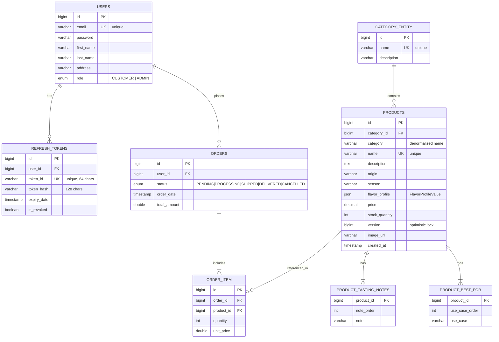
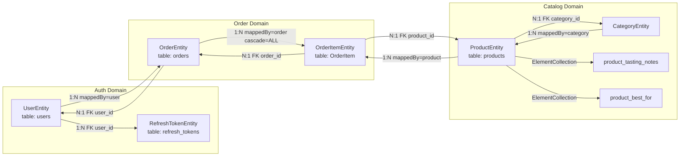

# Grove & Root — Entity Relationship Diagram (ERD)

> Render on GitHub, VS Code (Mermaid extension), or [mermaid.live](https://mermaid.live).

## ERD (Full Schema)

## Entity Relationships (JPA Mapping)

## Relationship Summary

| Entity A | Relationship | Entity B | Cardinality | Notes |
|----------|--------------|----------|-------------|-------|
| `UserEntity` | places | `OrderEntity` | 1 : N | FK `user_id` on `orders` |
| `UserEntity` | owns | `RefreshTokenEntity` | 1 : N | JWT refresh token rotation |
| `CategoryEntity` | contains | `ProductEntity` | 1 : N | FK `category_id`; denormalized `categoryName` |
| `OrderEntity` | includes | `OrderItemEntity` | 1 : N | `CascadeType.ALL` |
| `ProductEntity` | referenced in | `OrderItemEntity` | 1 : N | Snapshot `unit_price` at order time |
| `ProductEntity` | has | `product_tasting_notes` | 1 : N | `@ElementCollection` |
| `ProductEntity` | has | `product_best_for` | 1 : N | `@ElementCollection` |

## Enums

**UserRole:** `ADMIN`, `CUSTOMER`

**OrderStatus:** `PENDING`, `PROCESSING`, `SHIPPED`, `DELIVERED`, `CANCELLED`

### Order Status Side Effects

- Transition **to** `CANCELLED`: restore inventory (`releaseStock`)
- Transition **from** `CANCELLED` to active: reserve inventory again (`reserveStock`)

## Source Files

| Entity | Java Class |
|--------|------------|
| User | `src/main/java/com/thinhreal/applestore/model/entity/UserEntity.java` |
| Refresh Token | `src/main/java/com/thinhreal/applestore/model/entity/RefreshTokenEntity.java` |
| Category | `src/main/java/com/thinhreal/applestore/model/entity/CategoryEntity.java` |
| Product | `src/main/java/com/thinhreal/applestore/model/entity/ProductEntity.java` |
| Order | `src/main/java/com/thinhreal/applestore/model/entity/OrderEntity.java` |
| Order Item | `src/main/java/com/thinhreal/applestore/model/entity/OrderItemEntity.java` |
